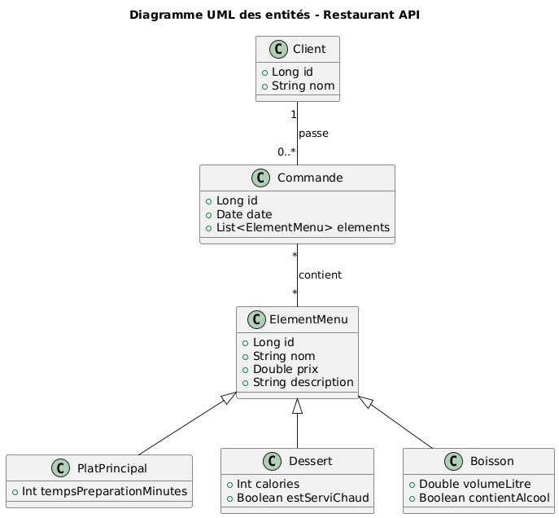

# 🍽️ Modern Hospitality - API Spring Boot & App Flutter

## 📝 Description
**Modern Hospitality** est un système complet de gestion de commandes pour restaurant, divisé en deux parties :
- **Un Backend (API REST)** développé en **Kotlin** avec **Spring Boot** pour gérer le catalogue, les clients et les commandes.
- **Un Frontend (Application Mobile)** développé avec **Flutter** offrant aux clients une interface moderne pour consulter le menu, gérer le panier et suivre les commandes (avec support du mode hors-ligne).

---

## 🛠️ Technologies Utilisées

### ⚙️ Backend (API)
- **Langage :** Kotlin
- **Framework :** Spring Boot 3
- **Base de données :** MySQL
- **Build Tool :** Gradle
- **ORM :** Spring Data JPA / Hibernate

### 📱 Frontend (Application Mobile)
- **Framework :** Flutter (Dart)
- **Gestion d'état :** Provider
- **Stockage local :** SQLite (sqflite) & SharedPreferences
- **Réseau :** http & connectivity_plus

---

## 📊 Diagramme UML


---

## 🗃️ Structure de la Base de Données
- **Client :** représente les clients du restaurant
- **Commande :** relie un client à plusieurs éléments du menu
- **ElementMenu :** classe mère (abstraite) des éléments du menu
- **PlatPrincipal :** représente les plats principaux
- **Boisson :** représente les boissons disponibles
- **Dessert :** représente les desserts proposés par le restaurant

---

## 🚀 Installation et Exécution

### 🔧 Prérequis
- JDK 17+
- MySQL installé
- Gradle
- SDK Flutter installé

---

### 🪜 1. Lancer le Backend (Spring Boot)

#### Cloner le repository
```bash
git clone https://github.com/hamzavscode/restaurant-ordering-system.git
```

#### Créer la base de données
```sql
CREATE DATABASE restaurant_db;
```

#### Configurer application.properties
Modifiez le fichier `src/main/resources/application.properties` si nécessaire :
```properties
spring.application.name=RestaurantApi
spring.datasource.url=jdbc:mysql://localhost:3306/restaurant_db
spring.datasource.username=root
spring.datasource.password=
spring.datasource.driver-class-name=com.mysql.cj.jdbc.Driver
spring.jpa.hibernate.ddl-auto=update
spring.jpa.database-platform=org.hibernate.dialect.MySQL8Dialect
spring.jpa.show-sql=true
```

#### Démarrer l'API
```bash
./gradlew bootRun
```
*Le backend sera accessible sur `http://localhost:8080`*

---

### 📱 2. Lancer le Frontend (Flutter)

Ouvrez un nouveau terminal et accédez au dossier `frontend` :

```bash
cd frontend
flutter pub get
flutter run
```
*(Vous pouvez lancer l'application sur un émulateur Android, iOS ou sur le Web).*

---

## 📡 Endpoints Disponibles (API)

### 👤 Client
- `GET /api/clients` → Récupérer tous les clients
- `GET /api/clients/{id}` → Récupérer un client par ID
- `POST /api/clients/register` → Créer un nouveau client
- `POST /api/clients/login` → Authentifier un client
- `PUT /api/clients/{id}` → Mettre à jour un client
- `DELETE /api/clients/{id}` → Supprimer un client

### 🍔 Plat Principal
- `GET /api/plats` → Récupérer tous les plats
- `GET /api/plats/{id}` → Récupérer un plat par ID
- `POST /api/plats` → Créer un plat
- `PUT /api/plats/{id}` → Mettre à jour un plat
- `DELETE /api/plats/{id}` → Supprimer un plat

### 🍰 Dessert
- `GET /api/desserts` → Récupérer tous les desserts
- `GET /api/desserts/{id}` → Récupérer un dessert par ID
- `POST /api/desserts` → Créer un dessert
- `PUT /api/desserts/{id}` → Mettre à jour un dessert
- `DELETE /api/desserts/{id}` → Supprimer un dessert

### 🥤 Boisson
- `GET /api/boissons` → Récupérer toutes les boissons
- `GET /api/boissons/{id}` → Récupérer une boisson par ID
- `POST /api/boissons` → Créer une boisson
- `PUT /api/boissons/{id}` → Mettre à jour une boisson
- `DELETE /api/boissons/{id}` → Supprimer une boisson

### 📦 Commande
- `GET /api/commandes` → Récupérer toutes les commandes
- `GET /api/commandes/{id}` → Récupérer une commande par ID
- `POST /api/commandes` → Créer une commande
- `PUT /api/commandes/{id}` → Mettre à jour une commande (ex: annuler)
- `DELETE /api/commandes/{id}` → Supprimer une commande

---

## ✨ Améliorations Techniques Intégrées
- **Architecture complète :** Backend Kotlin / Spring Boot couplé à une Application Mobile Flutter.
- **Support Hors-Ligne (Mobile) :** Mise en cache SQLite du menu et des commandes passées.
- **Gestion d'état (Flutter) :** Utilisation de `Provider` pour le panier et l'authentification.
- **Validation Backend :** Validation des données avec `@Valid`, `@NotNull`, `@NotBlank`.
- **Héritage JPA :** Utilisation de `Single Table Inheritance` pour unifier les entités du menu.
- **Gestion centralisée des exceptions :** via `@ControllerAdvice`.

---

## 📚 Documentation du code (Dokka)
La documentation générée par **Dokka** se trouve dans le dossier :
- `build/dokka/html/index.html`

---

## 👥 Auteurs
- Ali Benettoumi & Hamza Joual

**Date :** 31 Mai 2026